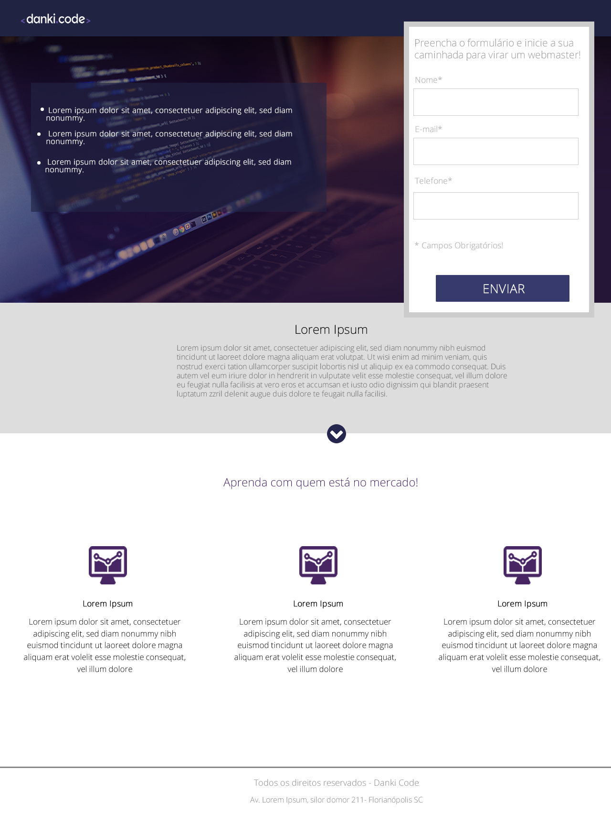

# responsive-landing-page
Reproduction of the following design using HTML/CSS

### Utility:
- Pratice responsive design using HTML and CSS

#### Material:
- HTML, CSS

#### Tutorial:
- Open terminal ( cmd, bash, etc... )
- Clone the repository ( <b>git clone https://github.com/moschiel/responsive-landing-page.git</b> ) in any directory you like.
- Access the folder <b>clone-facebook-screen-login</b>
- Open file <b>index.html</b> in any browser you like ( Ex: Chrome, Firefox... )

### Responsive Mode
For testing responsivity, resize your browser windows as you like.

### Images Source
- [Danki Code](https://cursos.dankicode.com/)
